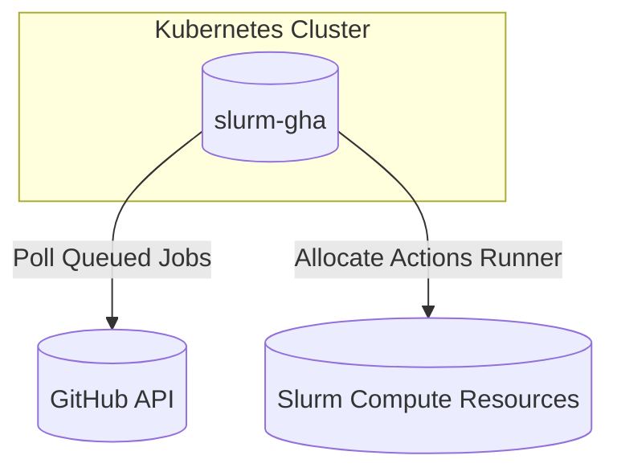
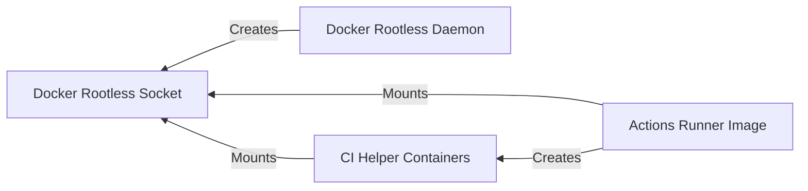

import { Cards } from 'nextra/components'
import Picture from '@/components/picture'
import {
  BlogSlurmCiGraphDark,
  BlogSlurmCiGraphLight,
  BlogSlurmCiPipelineDark,
  BlogSlurmCiPipelineLight,
} from '@/build/fixtures/images'


## Problem Statement
At WATcloud, we partition our compute resources into two primary pools: a small pool (\~60 vCPUs and \~120 GiB RAM) dedicated to a Kubernetes cluster, and a larger pool (\~240 vCPUs and \~700 GiB RAM) allocated to a Slurm cluster.

The Kubernetes cluster, managed by WATcloud administrators, hosts essential infrastructure including monitoring services, API backends, and the Slurm database and control servers. The Slurm cluster is available for use by cluster users through the open-source job scheduling system, [Slurm](https://slurm.schedmd.com/documentation.html).

Our Continuous Integration and Continuous Delivery (CI/CD) pipeline, responsible for provisioning compute resources and managing user workflows, runs on the Kubernetes cluster using GitHub Actions. This setup leverages the popular Kubernetes Operator, [actions-runner-controller (ARC)](https://github.com/actions/actions-runner-controller), maintained by GitHub.
<br />
<div className="flex justify-center items-center flex-col">
	<span className="hidden dark:block">
		<Picture alt="Slurm CI Pipeline (Dark)" image={BlogSlurmCiPipelineDark}  style={{ backgroundColor: 'transparent', backgroundImage: 'none', background: 'none'}} />
	</span>
	<span className="dark:hidden">
		<Picture alt="Slurm CI Pipeline (Light)" image={BlogSlurmCiPipelineLight} style={{ backgroundColor: 'transparent', backgroundImage: 'none', background: 'none'}} />
	</span>
	_Our current CI/CD pipeline_
</div>

The ARC performed reliably after the initial setup. However, as our pipeline grew, we found our Kubernetes cluster lacked sufficient resources to fully utilize potential parallelism, particularly when running multiple pipelines concurrently. Additionally, during periods without active jobs, resources remained idle and underutilized. While Kubernetes auto-scaling could address these challenges in cloud environments like AWS, GCP, or Azure, our infrastructure runs on bare-metal hardware, where resource allocation is fixed.

Considering this, we explored alternatives and identified Slurm—a dedicated job scheduling system—as potentially more suitable than Kubernetes for managing GitHub Actions workflows. Since ARC primarily functions as a job scheduler, Slurm aligns more naturally with our use case. With Slurm, we can leverage the significantly larger resource pool in our existing cluster, maximizing peak capacity during busy periods. Moreover, resources remain fully available for other workloads during idle periods, enhancing overall efficiency. Additionally, adopting Slurm simplifies resource accounting, allowing us to manage CI/CD workloads alongside other tenant workloads seamlessly, streamlining our overall resource management strategy.

| Computer Type      | Resources                                  |
|--------------------|--------------------------------------------|
| Kubernetes Cluster | Limited Dedicated Resources (~120 GiB RAM)  |
| Slurm Cluster      | Large Shared Resources (~700 GiB RAM)      |

The Slurm cluster offers significantly more resources, which allows us to have a higher peak throughput. Additionally, we could repurpose Kubernetes resources for Slurm if we no longer needed the actions-runner-controller.

## Solution
We opted to run our CI jobs on the Slurm cluster. After looking at available options, such as [github.com/ripley-cloud/gha-slurm](https://github.com/ripley-cloud/gha-slurm), we found them overly complex, often requiring multiple separately deployed modules.

This led us to implement our own solution which can be found [here](https://github.com/WATonomous/slurm-gha). In this blog post, we will explore the solution's architecture, challenges encountered, and performance improvements achieved.

### Solution Architecture
1. A Python script polls the GitHub API for queued jobs.
2. When a job is detected, an ephemeral action runner is allocated on the Slurm cluster.
3. Upon job completion, the runner and Slurm resources are released.

### Basic diagram of the system


## Minimum Viable Product (MVP)
After implementing an MVP of the script, we were able to run our CI jobs on the Slurm cluster. The biggest problem we encountered was that, unlike how Kubernetes nodes provide long-term image cache, we had to pull the runner image for every job. This added nearly two minutes to each job's execution time due to duplicate image pulls, which caused network congestion. Given that workflows contain up to 70 jobs, the additional time quickly became significant. This meant the implementation using Slurm was slower than the ARC.

## Speeding up the startup time of our Actions Runner Image
We explored caching the image manually on the filesystem but found it impractical due to the need to mount directories across multiple concurrent runners.

This led us to investigate several options:
- [Docker pull-through cache](https://docs.docker.com/docker-hub/mirror/)
- [Stargz Snapshotter](https://github.com/containerd/stargz-snapshotter)
- [Apptainer (formerly singularity)](https://apptainer.org/docs/user/main/index.html)

We tried all of the options, and below is a summary of our findings.

| Method | Description | Pros | Cons |
|--------|-------------|------|------|
| Docker pull-through cache | Relocates network traffic from the 1 Gbps uplink to the 10 Gbps cluster network. | Straightforward, directly compatible with Docker, relatively easy to set up | Pulled image still needs to be extracted (~20s) |
| Stargz snapshotter | Uses a special image format to allow starting the image without fully downloading it. | Quick startup time, doesn't require full image downloads | Difficult to set up, still prone to duplicate network traffic |
| Apptainer | Alternative to Docker. Allows starting images from unpacked layers. | Very quick startup time; when combined with CVMFS, provides file-level caching and deduplication | Difficult to set up, requires switching from Docker to Apptainer |

We ultimately chose the Apptainer approach. We already have CVMFS set up as a part of our SLURM cluster, and we found that CERN has a public CVMFS repository, [`unpacked.cern.ch`](https://indico.cern.ch/event/764570/contributions/3173502/attachments/1735975/2807816/CVMFS-unpacked.pdf), where anyone can submit images to and get them served as unpacked layers. They [kindly](https://github.com/cvmfs/images-unpacked.cern.ch/pull/29) hosted our runner image for us. 

With Apptainer set up, the runner image's startup time with the cached and unpacked image was much faster, and repeated access from different jobs is pretty much instant. Since we have a fixed number of Slurm nodes, this optimization reduced network traffic from 1 image fetch per job to 1 image fetch per node. It even improved compared to the original ARC setup, because CVMFS automatically does file-level deduplication, and runner image updates often don't change too much. This was a significant improvement for a pipeline executing 25,000 jobs per month, consuming 35,000 minutes of runtime.

## Speeding up our provisioner image pull
A second major challenge involved the repeated pulling of our provisioner image, a 1.5GB container used to [provision services](../docs/community-docs/watcloud/development-manual#terminology). This image differs from the Actions Runner image as it is rebuilt within each workflow, making caching trickier.

### Previous Solution
Originally, we created and uploaded the provisioner image to a self-hosted S3-compatible [RGW](https://docs.ceph.com/en/latest/man/8/radosgw/) store in each workflow run. When using the actions-runner-controller, this setup worked well, as each job only involves one network hop (both the job pod and the RGW pod run on Kubernetes). With Slurm, however, jobs now required at least one hop (from the Slurm node to the Kubernetes ingress), and sometimes two (in case the Kubernetes ingress pod is on a different Kubernetes node than the RGW pod). Going through the Kubernetes ingress turned out to be much slower than using the internal Kubernetes network.

```mermaid
flowchart TD
    SLURM[SLURM Job Node] -->|1 hop| Kubernetes[Kubernetes Ingress]
    Kubernetes Ingress -->|0 or 1 depending on pod locations| RGW[RGW Pod]
```

### Inspiration from CERN
Initially, we looked to use the same Apptainer solution as we had for the runner image. However, this presented a new set of challenges, namely, that the CVMFS [DUCC](https://cvmfs.readthedocs.io/en/stable/cpt-ducc.html) pipeline is used to unpack the image for use in `unpacked.cern.ch`. Since the CERN pipeline runs hourly, we looked into running the DUCC command ourselves. However, the DUCC command builds multiple sets of layers to be compatible with software like Podman and ultimately took too long (around 2 minutes for the provisioner container) for our use case. 

### Our Solution : CVMFS Ephemeral Server
This led us to develop a [custom Docker unpack](https://github.com/WATonomous/docker-unpack) tool which only does a simple unpack. This reduced the unpacking time from minutes to around 10 seconds. We use this tool in our on-prem [CVMFS ephemeral server](https://github.com/WATonomous/cvmfs-ephemeral/). This is a CVMFS stratum 0 server meant for storing ephemeral data, like our provisioner image.

## Results
Comparing the actions-runner-controller to the Slurm implementation, we observed a significant reduction in runtime. We have 2 main workflow types: the main branch workflow which includes around 70 jobs, and the user ingestion precheck, which does a dry-run on a smaller set of jobs affecting user provisioning.

By leveraging Apptainer to reduce the frequency of image pulls, and adopting a CVMFS stratum 0 server for caching our provisioner images, we found **✨50%✨** reduction in time across both main branch and user ingestion workflows.

<br />

<div className="flex justify-center items-center">
	<span className="hidden dark:block">
		<Picture alt="Slurm CI Graph (Dark)" image={BlogSlurmCiGraphDark}  style={{ backgroundColor: 'transparent', backgroundImage: 'none', background: 'none'}} />
	</span>
	<span className="dark:hidden">
		<Picture alt="Slurm CI Graph (Light)" image={BlogSlurmCiGraphLight} style={{ backgroundColor: 'transparent', backgroundImage: 'none', background: 'none'}} />
	</span>
</div>

> **Note:** The actions-runner-controller (before) has higher variance as the resources can become saturated by concurrent workflows. The Slurm implementation (after) has a more consistent runtime as there are sufficient resources to achieve full parallelism.

## Conclusions

Migrating GitHub Actions workloads to the Slurm cluster provided a scalable and resource-efficient solution to the limitations of our existing Kubernetes setup. By leveraging our existing HPC infrastructure, including CVMFS, we are able to achieve higher parallelism, reduce idle costs, and consolidate resource management. This approach demonstrates how job schedulers like Slurm can effectively handle CI/CD workflows. In the future, we hope to further optimize our CI/CD pipeline through conditional job execution and more efficient resource planning to maximize developer velocity.

## Appendix

<details>
  <summary>Some useful tools WATcloud made for analyzing GitHub Actions performance</summary>

- [CI Runtime tool](https://github.com/WATonomous/ci-runtime) : Calculate the fastest theoretical runtime for a Github Actions workflow assuming infinite concurrency and no waiting between jobs.
- [GitHub Actions tracing](https://github.com/WATonomous/github-actions-tracing) : A tool for generating traces from GitHub Actions. The generated traces are compatible with Perfetto.

</details>

<details>
  <summary>Other implementation details</summary>

### Enabling Docker Within CI Jobs

We run our CI jobs with a container, [actions-runner-image](https://github.com/WATonomous/actions-runner-image). Within these jobs we also run containers, thus we needed to run Docker within Docker.



Normally it would be a security risk to mount the Docker socket into a container, but since we are using [Docker Rootless](https://docs.docker.com/engine/security/rootless/), we are able to mitigate this risk.

> **Note:** The CI's Docker commands will use the same filesystem, as they have the same Docker socket, you must configure the working directory of your runners accordingly. In our case this meant placing the working directory in ephemeral storage, via the `/tmp/` folder within a Slurm job.

### Deployment to Kubernetes

We deployed this on our self-hosted Kubernetes via a Docker image. To communicate with the GitHub API, an access token is needed. For our use case, a [personal access token](https://docs.github.com/en/authentication/keeping-your-account-and-data-secure/managing-your-personal-access-tokens#about-personal-access-tokens) which provides 5000 requests per hour was sufficient.

To enable communication with the Slurm controller, we set up a [munge key](https://dun.github.io/munge/). The Python script is then able to allocate an Actions Runner by triggering a bash script run with `sbatch`.

</details>