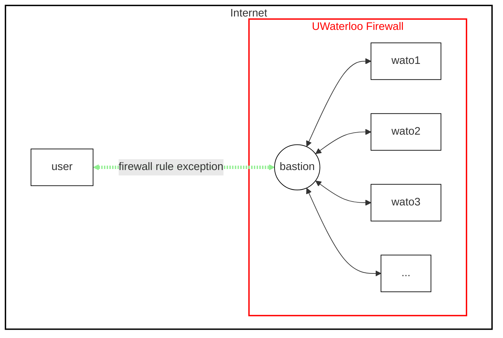
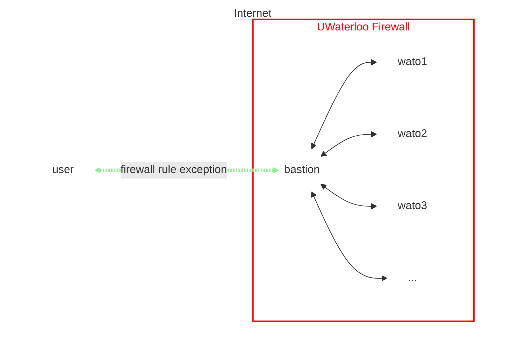

# Firewall

The WATcloud compute cluster is housed at the University of Waterloo. All machines in the cluster are behind the University's firewall.
In order to connect to the cluster, you must be on the campus network, connected to the University's [VPN][uw-vpn], or use a
[Bastion](#bastion) as a jump host.

[uw-vpn]: https://uwaterloo.atlassian.net/wiki/spaces/ISTKB/pages/262012980/Virtual+Private+Network+VPN

## Bastion

A Bastion (or "Bastion Host") is a machine that is exposed to the internet and is used as a gateway to access other machines that are
behind a firewall[^bastion]. At WATcloud, we host a Bastion that you can use to connect to the cluster.

[^bastion]: See the [Wikipedia page](https://en.wikipedia.org/wiki/Bastion_host) for more information.

## VPN

A VPN (or "Virtual Private Network") is a service that allows you to connect to a private network over the internet.
The University of Waterloo provides a [VPN][uw-vpn] service that allows you to connect to the campus network from anywhere
in the world. Once you are on the UWaterloo VPN, you can connect to the WATcloud compute cluster as if you were on campus.

[uw-vpn]: https://uwaterloo.atlassian.net/wiki/spaces/ISTKB/pages/262012980/Virtual+Private+Network+VPN

{
// Separate footnotes from the main content
}
import { Separator } from "@/components/ui/separator"

<Separator className="mt-6" />
