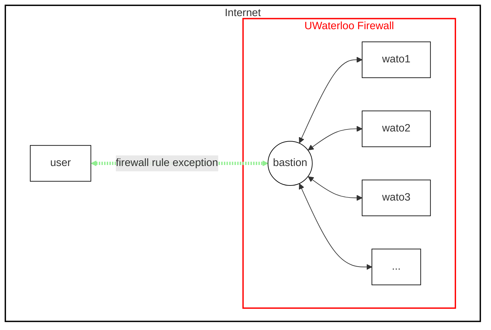
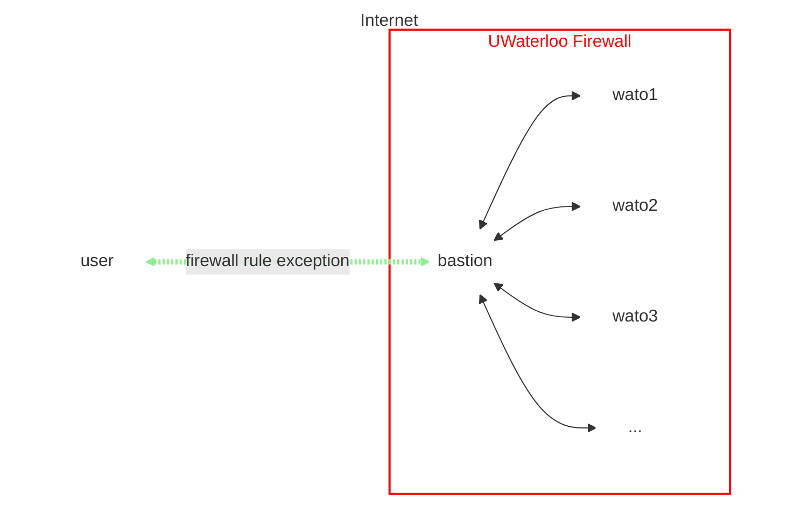

# SSH

Now that you have access to the WATcloud compute cluster (Don't have access yet? Make a request [here](./getting-access)),
you can use [SSH](https://www.cloudflare.com/learning/access-management/what-is-ssh/) to connect to the cluster.

## Quick Start

Here's a tool to help you generate a personalized SSH command. This tool will generate a command that you can copy and paste into your terminal.

### Command Generator

Choose your preferred machine and entrypoint[^entrypoint] below. Your personalized SSH command will be generated and displayed below.

[^entrypoint]: An entrypoint is a service or location that you connect to or be at when you connect to the cluster. This is necessary
because the cluster is behind a [firewall](#firewall) and you cannot connect to it directly.

import { SSHCommandGenerator } from '@/components/ssh-command-generator'

<div className="mt-2">
    <SSHCommandGenerator />
</div>

The above is your personalized SSH command. Copy and paste it into your terminal to connect to the cluster.

The generated command does *not* require setting up [ssh agent](https://www.ssh.com/ssh/agent) or [ssh config](https://www.ssh.com/ssh/config/).
However, you may soon find that setting them up will make your life easier. If you are interested in learning more about these
tools, please check out the official documentation linked above and use your [search-fu](https://www.urbandictionary.com/define.php?term=search-fu)
to find more resources.

## Syntax

The general syntax for connecting to the cluster is:

```bash copy
SSH_KEY_PATH="<path_to_ssh_key>"
SSH_USERNAME="<username>"
SSH_HOST="<hostname>"
ssh -v -i "$SSH_KEY_PATH" "$SSH_USERNAME@$SSH_HOST"
```

or if you are using a jump host:

```bash copy
SSH_KEY_PATH="<path_to_ssh_key>"
SSH_USERNAME="<username>"
SSH_HOST="<hostname>"
SSH_JUMP_HOST="<jump_host>"
ssh -v -o ProxyCommand="ssh -W %h:%p -i \"$SSH_KEY_PATH\" \"$SSH_USERNAME@$SSH_JUMP_HOST\"" -i "$SSH_KEY_PATH" "$SSH_USERNAME@$SSH_HOST"
```

## Firewall

The WATcloud compute cluster is housed at the University of Waterloo. All machines in the cluster are behind the University's firewall.
In order to connect to the cluster, you must be on the campus network, connected to the University's [VPN][uw-vpn], or use a
[Bastion](#bastion) as a jump host.

[uw-vpn]: https://uwaterloo.ca/web-resources/resources/virtual-private-network-vpn

### Bastion

A Bastion (or "Bastion Host") is a machine that is exposed to the internet and is used as a gateway to access other machines that are
behind a firewall[^bastion]. At WATcloud, we host a Bastion that you can use to connect to the cluster.

[^bastion]: See the [Wikipedia page](https://en.wikipedia.org/wiki/Bastion_host) for more information.

<span className="dark:hidden">

</span>
<span className="hidden dark:block">

</span>


import { Separator } from "@/components/ui/separator"

<Separator className="mt-6" />
